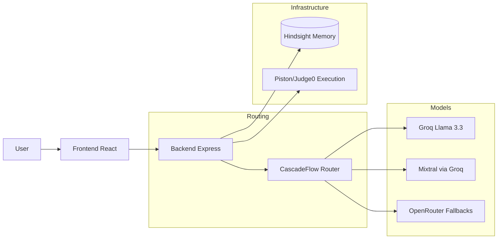

# Refyn

> Your code. Reviewed. Remembered. Refined.


Refyn is a browser-based, VS Code-style IDE designed for instant, AI-powered code reviews and execution. Built for the Hindsight x CascadeFlow Hackathon, it intelligently routes code analysis requests based on complexity—sending simple functions to fast, cheap models while reserving powerful LLMs for complex or security-sensitive code. By integrating persistent memory, Refyn remembers your coding patterns and recurring issues across sessions, ensuring reviews become smarter and highly personalized over time.

## Architecture



## Core Features

### AI Code Review
Every code submission is thoroughly analyzed to generate an overall score along with a detailed breakdown of security, performance, bugs, and code quality. Issues are identified with specific line numbers and severity levels, accompanied by actionable explanations and an optimized version of the entire codebase.

### CascadeFlow Routing
To balance cost and speed without sacrificing accuracy, an internal complexity scorer analyzes the submitted code before it ever reaches an LLM. This score dictates the model routing—simple scripts hit smaller, faster models, while intricate logic routes to heavy-duty models like Llama 3.3 70B, with a stats bar exposing the exact latency, model, and cost savings for full transparency.

### Hindsight Memory
Using the Hindsight SDK, Refyn maintains a persistent memory of your specific development habits. By tracking your recurring mistakes and stylistic preferences across different sessions, the AI adapts its feedback to stop pointing out issues you've explicitly rejected and start guiding you away from habits you repeatedly fall into. 

### Smart Fix
When an issue is identified during the review, developers can trigger a dedicated fix sequence for that specific line or block of code. The system generates a clean before-and-after diff, allowing you to instantly accept and apply the targeted fix directly into the Monaco editor without re-generating the entire file.

### Code Execution
Refyn goes beyond static analysis by allowing developers to instantly compile and run their code in an integrated terminal panel. It utilizes the Piston API as the primary execution engine for high-speed runs, falling back to Judge0 and local runners to ensure execution is always available.

### Multi-Language Support
The workspace is fully equipped to handle modern software development across a wide variety of languages. Whether you are writing Python, JavaScript, TypeScript, Java, C++, Go, or Rust, the editor provides appropriate syntax highlighting, execution runtimes, and language-specific AI analysis.

## Setup Instructions

Clone the repository and install dependencies for both the frontend and backend environments. 

```bash
git clone https://github.com/yourusername/refyn.git
cd refyn

# Install backend dependencies
cd backend
npm install

# Install frontend dependencies
cd ../frontend
npm install
```

Create a `.env` file in the `/backend` directory and add your API keys.

```bash
touch backend/.env
```

Start the backend server on port 5000, then start the Vite development server for the frontend.

```bash
# In the backend directory
npm run dev

# In the frontend directory (new terminal)
npm run dev
```

## Environment Variables

| Variable | Description | Required |
|----------|-------------|----------|
| `GROQ_API_KEY` | Primary API key for blazing-fast inference via Llama 3.3 70B and Mixtral. | Yes |
| `OPENROUTER_API_KEY` | Fallback API key for routing to free models when Groq hits rate limits. | Yes |
| `HINDSIGHT_API_KEY` | Connects to Vectorize Hindsight for persistent user pattern memory. | Yes |

## Built With
- **Frontend:** React, Vite, Tailwind CSS, Framer Motion, Monaco Editor
- **Backend:** Node.js, Express
- **AI Infrastructure:** Groq, OpenRouter
- **Memory Infrastructure:** Hindsight (`@vectorize-io/hindsight-client`)
- **Execution Environments:** Piston API, Judge0

## Future Scope
- **Code Comparison:** The UI already exists to diff two versions of code side-by-side; pending deeper AI integration to judge performance and cleanliness between versions.
- **Learn Mode:** An interactive, conversational tutor that provides educational explanations of coding concepts and identified issues.
- **Interview Prep:** A dedicated mode that automatically generates technical interview questions tailored specifically to the weaknesses found in your historical code patterns.
- **GitHub PR Integration:** Direct integration to run Refyn's AI analysis as an automated review on pull requests.

## License
MIT License
